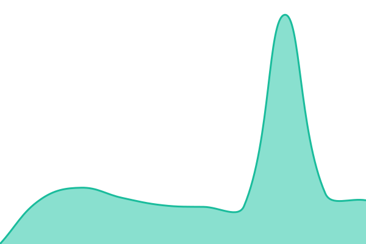

# [📈 Live Status](https://luschmar.github.io/upptime): <!--live status--> **🟧 Partial outage**

This repository contains the open-source uptime monitor and status page for [luschmar](https://luschmar.github.io/upptime), powered by [Upptime](https://github.com/upptime/upptime).

With [Upptime](https://upptime.js.org), you can get your own unlimited and free uptime monitor and status page, powered entirely by a GitHub repository. We use [Issues](https://github.com/luschmar/upptime/issues) as incident reports, [Actions](https://github.com/luschmar/upptime/actions) as uptime monitors, and [Pages](https://luschmar.github.io/upptime) for the status page.

<!--start: status pages-->
<!-- This summary is generated by Upptime (https://github.com/upptime/upptime) -->
<!-- Do not edit this manually, your changes will be overwritten -->
<!-- prettier-ignore -->
| URL | Status | History | Response Time | Uptime |
| --- | ------ | ------- | ------------- | ------ |
|  [Federation - matrix.luschmar.ch](https://matrix.luschmar.ch/.well-known/matrix/server) | 🟥 Down | [federation-matrix-luschmar-ch.yml](https://github.com/luschmar/upptime/commits/HEAD/history/federation-matrix-luschmar-ch.yml) | 

 4431ms
     
 | 

<a href="https://luschmar.github.io/upptime/history/federation-matrix-luschmar-ch">99.89%</a>
    

|  [Client - matrix.luschmar.ch](https://matrix.luschmar.ch/.well-known/matrix/client) | 🟥 Down | [client-matrix-luschmar-ch.yml](https://github.com/luschmar/upptime/commits/HEAD/history/client-matrix-luschmar-ch.yml) | 

 4350ms
     
 | 

<a href="https://luschmar.github.io/upptime/history/client-matrix-luschmar-ch">99.91%</a>
    

|  [Traccar](https://traccar.luschmar.ch/api/server) | 🟥 Down | [traccar.yml](https://github.com/luschmar/upptime/commits/HEAD/history/traccar.yml) | 

 737ms
     
 | 

<a href="https://luschmar.github.io/upptime/history/traccar">100.00%</a>
    

|  [Blog](https://blog.luschmar.ch) | 🟩 Up | [blog.yml](https://github.com/luschmar/upptime/commits/HEAD/history/blog.yml) | 

 716ms
     
 | 

<a href="https://luschmar.github.io/upptime/history/blog">100.00%</a>
    

|  [Memos](https://memos.luschmar.ch/api/v1/instance/profile) | 🟩 Up | [memos.yml](https://github.com/luschmar/upptime/commits/HEAD/history/memos.yml) | 

 672ms
     
 | 

<a href="https://luschmar.github.io/upptime/history/memos">100.00%</a>
    

|  [Auth](https://auth.luschmar.ch/health) | 🟩 Up | [auth.yml](https://github.com/luschmar/upptime/commits/HEAD/history/auth.yml) | 

 686ms
     
 | 

<a href="https://luschmar.github.io/upptime/history/auth">100.00%</a>
    

<!--end: status pages-->

[**Visit our status website →**](https://luschmar.github.io/upptime)

## 📄 License

- Powered by: [Upptime](https://github.com/upptime/upptime)
- Code: [MIT](./LICENSE) © [luschmar](https://luschmar.github.io/upptime)
- Data in the `./history` directory: [Open Database License](https://opendatacommons.org/licenses/odbl/1-0/)
